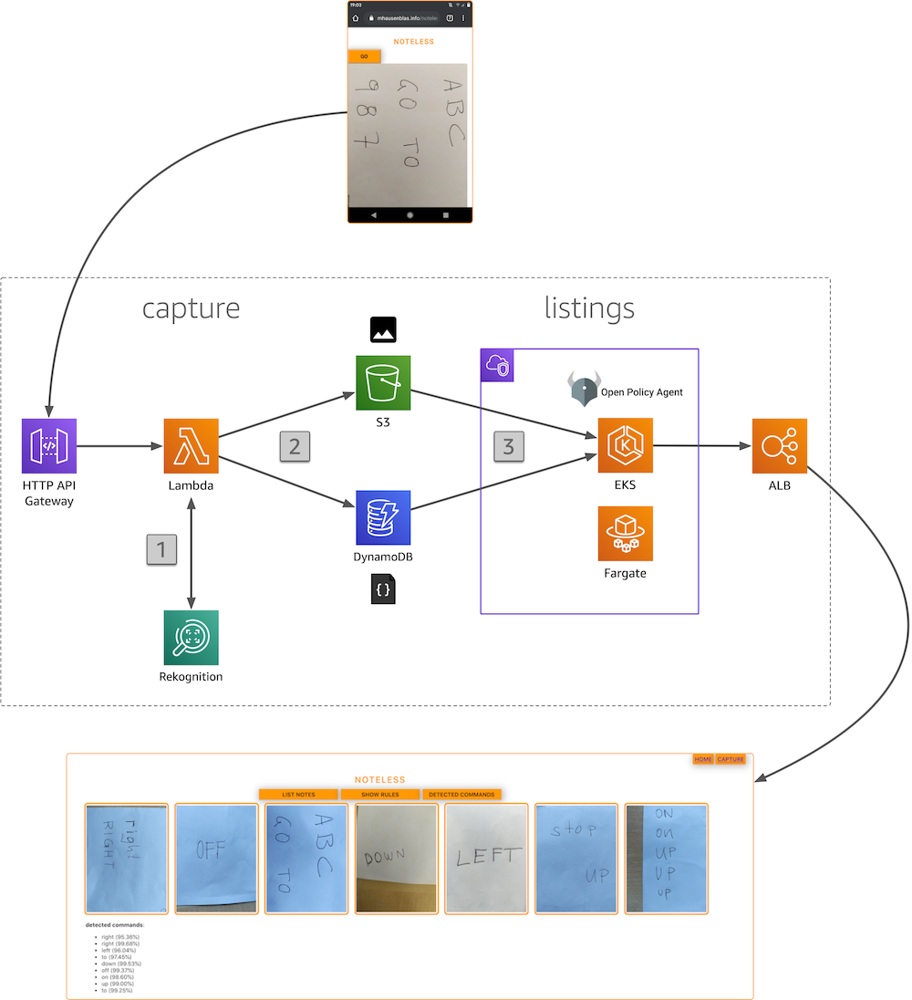

# noteless

## Usage

The **noteless** serverless demo is available online through this page and allows you analyse pictures for certain command words ("go", "stop", "on", "off", "left", "right", "up", "down", "to"). First, you'd capture a picture 
that contains some text and then you can view the results of the analysis.  

### Capture

You [capture](http://mhausenblas.info/noteless/capture/) pictures containing text, ideally using your phone's camera:

Once you have captured a few text fragments, you move on to the analysis stage.

### Analyse

You [analyse](http://mhausenblas.info/noteless/notes/) by applying [predefined OPA Rego rules](https://github.com/mhausenblas/noteless/blob/aa4c6de9749c57a3381b56777351fed6c0a3c6f0/listings/main.go#L27) and if **noteless** recognizes a command like `up` or `go` it will list it:

## Background

### Architecture

This is a serverless end-to-end demo with an architecture as follows:

 **noteless** uses the following serverless AWS services:

1. [Amazon Rekognition](https://aws.amazon.com/rekognition/) for detecting text in images
2. [AWS Lambda](https://aws.amazon.com/lambda/) for the capture/frontend processing
3. [Amazon EKS](https://aws.amazon.com/eks/) on [AWS Fargate](https://aws.amazon.com/fargate/) for the event-driven analytics part with an [Open Policy Agent](https://www.openpolicyagent.org/) Rego-based set of rules.
4. [Amazon S3](https://aws.amazon.com/s3/) for storing the captured images and [Amazon DynamoDB](https://aws.amazon.com/dynamodb/) to persist the detected text in JSON format.

### Deploy yourself

If you want to try it out yourself, deploying the demo in your own environment, the source code is available via [mhausenblas/noteless](https://github.com/mhausenblas/noteless). Kudos go out to Mike Rudolph for [mikerudolph/aws_rekognition_demo](https://github.com/mikerudolph/aws_rekognition_demo) which
served as a starting point for this demo.

First, create an S3 Bucket for the Lambda code and provide it as an input
for the [Makefile](https://github.com/mhausenblas/noteless/blob/master/functions/Makefile) as `NOTELESS_BUCKET` when you run `make up`. This sets up
the Lambda functions, the DynamoDB table, and the S3 data bucket.

For the container part: run first [create-eks-fargate-cluster.sh](https://github.com/mhausenblas/noteless/blob/master/listings/create-eks-fargate-cluster.sh) to set up the EKS on Fargate cluster and then [create-alb.sh](https://github.com/mhausenblas/noteless/blob/master/listings/create-alb.sh) for the ALB 
Ingress controller. Finally, execute [launch-backend.sh](https://github.com/mhausenblas/noteless/blob/master/listings/launch-backend.sh) to launch the Kubernetes deployment and service. TBD: patching frontends …