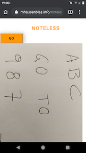
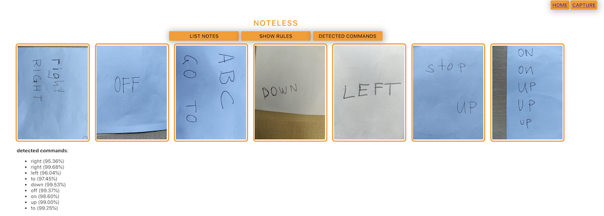

# noteless

## Usage

The **noteless** demo allows you to do two things:

### Capture

You can [capture](capture/) text, using for example your phone camera to capture notes in print or handwritten versions on paper.

### Analyse

Once notes are captured, you can [analyse](notes/) them. By applying OPA Rego rules, **noteless** finds certain predefined commands such as `up` or `go`:

## Deploy yourself

First, create an S3 Bucket for the Lambda code and provide it as an input
for the [Makefile](https://github.com/mhausenblas/noteless/blob/master/functions/Makefile) as `NOTELESS_BUCKET` when you run `make up`. This sets up
the Lambda functions, the DynamoDB table, and the S3 data bucket.

For the container part: run first [create-eks-fargate-cluster.sh](https://github.com/mhausenblas/noteless/blob/master/listings/create-eks-fargate-cluster.sh) to set up the EKS on Fargate cluster and then [create-alb.sh](https://github.com/mhausenblas/noteless/blob/master/listings/create-alb.sh) for the ALB 
Ingress controller. Finally, execute [launch-backend.sh](https://github.com/mhausenblas/noteless/blob/master/listings/launch-backend.sh) to launch the Kubernetes deployment and service. TBD: patching frontends …

## Background

This is a serverless end-to-end demo and it uses:

1. [Amazon Rekognition](https://aws.amazon.com/rekognition/) for detecting text in images
2. [AWS Lambda](https://aws.amazon.com/lambda/) for the capture/frontend processing
3. [Amazon EKS](https://aws.amazon.com/eks/) on [AWS Fargate](https://aws.amazon.com/fargate/) for the event-driven analytics part with an [Open Policy Agent](https://www.openpolicyagent.org/) Rego-based set of rules.
4. [Amazon S3](https://aws.amazon.com/s3/) and [Amazon DynamoDB](https://aws.amazon.com/dynamodb/) for storing the capture images and the detected text.

You might want to check out the [architecture](https://mhausenblas.info/noteless/docs/design.pdf) and if you want to try it out yourself, 
the source code is available via [mhausenblas/noteless](https://github.com/mhausenblas/noteless). Kudos go out to Mike Rudolph for [mikerudolph/aws_rekognition_demo](https://github.com/mikerudolph/aws_rekognition_demo) which
served as a starting point for this demo.

The architecture is as follows:

TBD